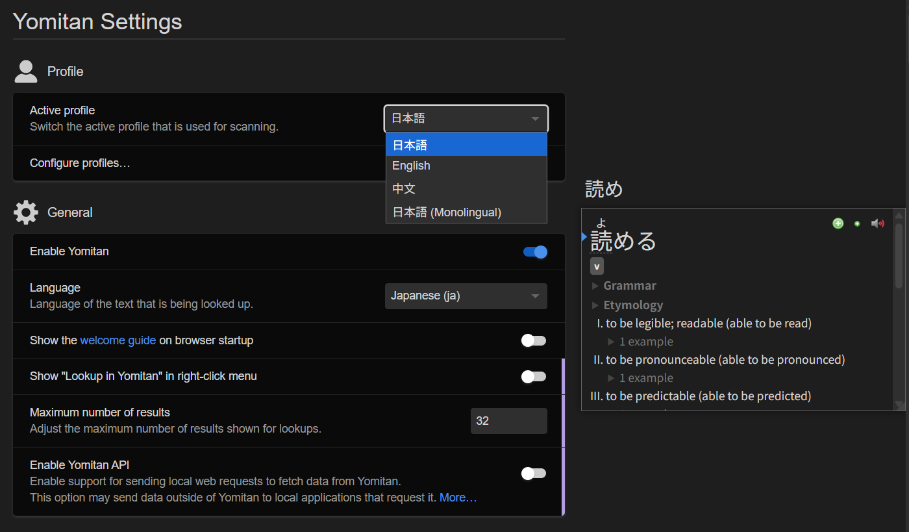

# JP-study

- [Anki](#anki)
  - [Anki Mining Template](#anki-mining-template)
  - [Basic Note Template](#basic-note-template)
  - [Kanken Deck Template](#kanken-deck-template)
- [Yomitan Profiles](#yomitan-profiles)

## Anki

### Anki Mining Template

Anki Mining card template for Japanese.

[Download](https://github.com/rudnam/JP-study/raw/main/Mining_temp.apkg)

<p>
    
    
    
</p>

#### Yomitan fields

| Field              | Value                                             |
| ------------------ | ------------------------------------------------- |
| Expression         | `{expression}`                                    |
| ExpressionFurigana | `{furigana-plain}`                                |
| ExpressionReading  | `{reading}`                                       |
| ExpressionAudio    | `{audio}`                                         |
| MainDefinition     | `{popup-selection-text}`                          |
| Sentence           | `{cloze-prefix}<b>{cloze-body}</b>{cloze-suffix}` |
| SentenceFurigana   |                                                   |
| SentenceAudio      |                                                   |
| FullDefinition     | `{glossary}`                                      |
| Image              |                                                   |
| Translation        |                                                   |
| PitchPosition      | `{pitch-accent-positions}`                        |
| Hint               |                                                   |
| Frequency          | `{frequencies}`                                   |
| FreqSort           |                                                   |
| MiscInfo           | `{document-title}`                                |
| ExtraField         |                                                   |
| \*IsSentenceCard   |                                                   |

Notes:

- When the **\*IsSentenceCard** field is filled with any character, card is turned into a sentence card. When empty, it is turned into a vocab card.
- The **MainDefinition** field is for the displayed definition on the card. When empty, the template displays a definition from the **FullDefinition** field. The preferred dictionaries for the default definition can be changed in the [back template](https://github.com/rudnam/JP-study/blob/da0fcca7242513065a5706b58e089a38baab584e/2_Mining_Back.html#L653-L667).
- The **PitchPosition** field takes in `{pitch-accent-positions}`. `{pitch-accents}` and `{pitch-accent-graphs}` will **not** work.
- The **FreqSort** field is for frequency sorting. (See [freq](https://github.com/MarvNC/JP-Resources#sorting-mined-anki-cards-by-frequency))
- The **Hint** field is for a hint on the front of the card (See [Animecards](https://animecards.site/ankicards/#the-hint-field)).
- The furigana fields only take in plain furigana. (e.g. 漢字[かんじ] not <ruby>漢字<rt>かんじ</rt></ruby>).
- The color scheme can be inherited from system by removing [this rule](https://github.com/rudnam/JP-study/blob/485e28eacb3445fa1cbf14714154063482c5bbe1/3_Mining_Styling.css#L70-L74) from the styling template.

#### Mpvacious

For [mpvacious](https://github.com/Ajatt-Tools/mpvacious), fields can be filled like the following. In `subs2srs.conf`:

```
model_name=Mining-JP

sentence_field=Sentence
secondary_field=Translation
audio_field=SentenceAudio
image_field=Image
miscinfo_field=MiscInfo

# The tag(s) added to new notes. Spaces separate multiple tags.
note_tag=subs2srs
```

#### Jidoujisho

For [jidoujisho](https://github.com/lrorpilla/jidoujisho), fields can be filled like the following:

| Field              | Value          |
| ------------------ | -------------- |
| Expression         | Term           |
| ExpressionFurigana | Furigana       |
| ExpressionReading  | Reading        |
| ExpressionAudio    | Term Audio     |
| Sentence           | Sentence       |
| SentenceAudio      | Sentence Audio |
| FullDefinition     | Meaning        |
| Image              | Image          |
| FreqSort           | Frequency      |
| MiscInfo           | Context        |

- [x] Include image/audio HTML tags on export
- [x] Use line break tag instead of newline on export
- [x] Prepend dictionary name in meaning

### Basic Note Template

These days I prefer to keep my cards simple and just use the basic front/back template with minor changes to its styling.

<p>
    
</p>

Just copy this into the _Basic_ note type's Styling tab:

```css
.card {
  font-family: -apple-system, BlinkMacSystemFont, Arimo, Inter, Roboto,
    'Segoe UI', Arial, 'Noto Sans JP', 'Noto Sans SC', sans-serif;

  margin: 0 auto;
  padding: 80px 20px;
  max-width: 650px;
  text-align: left;
  font-size: 20px;
  line-height: 1.6;
  background-color: white;

  -webkit-font-smoothing: antialiased;
  -moz-osx-font-smoothing: grayscale;
}
```

### Kanken Deck Template

Anki card template for the [Kanken Deck](https://ankiweb.net/shared/info/759825185).

<p>
    
</p>

Just copy and paste the following templates into Anki.

- Front Template

  ```html
  <div class="meta">Kanken Level: {{KankenLevel}}</div>

  <div class="sentence">{{SentenceFront}}</div>

  <div class="main-image">{{Picture}}</div>

  {{KankenAudio}}
  ```

- Back Template

  ```html
  <div class="meta">Kanken Level: {{KankenLevel}}</div>

  <div class="sentence">{{SentenceBack}}</div>

  <div class="main-image">{{Picture}}</div>

  {{KankenAudio}}

  <hr class="divider" />

  <div class="meaning">{{Meaning}}</div>

  <div class="diagram">{{Diagram}}</div>
  ```

- Styling

  ```css
  .card {
    font-family: -apple-system, BlinkMacSystemFont, Arimo, Inter, Roboto,
      'Segoe UI', Arial, 'Noto Sans JP', sans-serif;
    font-size: 16px;
    line-height: 1.6;
    text-align: center;
    padding: 24px 24px;
    max-width: 600px;
    margin: 0 auto;
    text-align: left;

    -webkit-font-smoothing: antialiased;
    -moz-osx-font-smoothing: grayscale;
  }

  .meta {
    font-size: 14px;
  }

  .sentence {
    font-size: 26px;
    font-weight: 500;
    margin-bottom: 1rem;
  }

  .main-image img {
    max-height: 25dvh;
    height: auto;
  }

  .divider {
    border: none;
    border-top: 1px solid #ccc;
    margin: 32px 0 24px;
  }

  .meaning {
    font-size: 20px;
    font-weight: 500;
  }

  .diagram img {
    max-height: 22.5dvh;
  }

  u {
    color: #3740ff;
    font-size: 1.2em;
    text-decoration: none;
  }

  body.nightMode u {
    color: #82aaff;
  }
  ```

## Yomitan Profiles

Includes 4 profiles: Japanese, English, Chinese, and Japanese (Monolingual definitions).

Choose to either download all or only Japanese profiles.

[Download Link](https://drive.google.com/drive/folders/1ZRmOjhjY1U3e76M_9dTo5w3-fi8NDyxj?usp=sharing)



<p>
    
</p>

<p>
    
</p>

Dictionaries, Audio Playback sources, and Anki are set up for each profile.

Note: Import the dictionaries first, and then the settings.

Also, importing _all_ the dictionaries **takes a while**.

| Profile                            | Dictionaries Included                | Shortcut     |
| ---------------------------------- | ------------------------------------ | ------------ |
| Japanese                           | JA-EN Wiktionary[^1], JPDB Frequency | Shift[^2]    |
| English                            | EN-EN Wiktionary[^1]                 | Ctrl + Shift |
| Chinese                            | CC-CEDICT, BLCUmixed Frequency       | Alt + Shift  |
| Japanese (Monolingual definitions) | 大辞林, JPDB Frequency               | Shift[^2]    |

[^1]: [Kaikki-to-Yomitan](https://github.com/yomidevs/kaikki-to-yomitan)
[^2]: Set either Japanese or Japanese (Monolingual) as default profile
